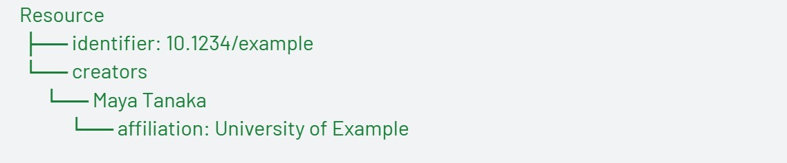
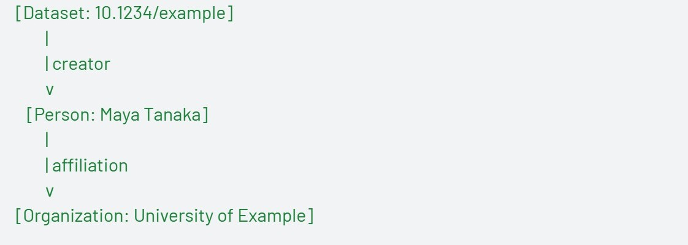
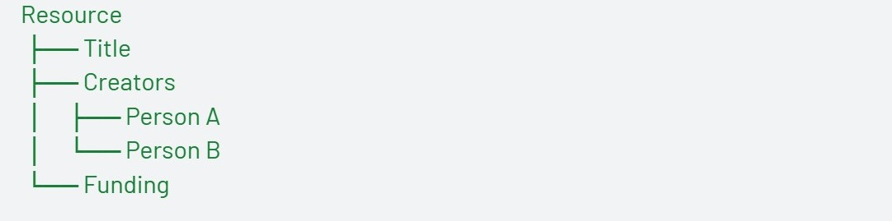
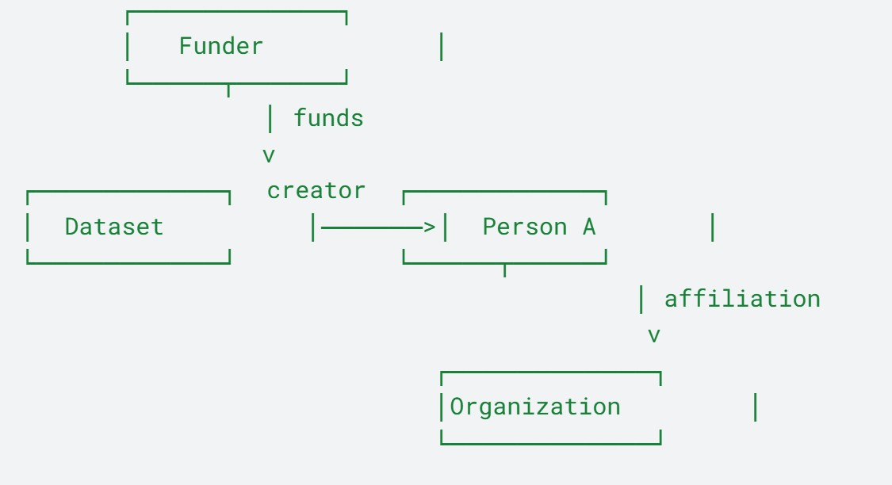

<!--more-->

## Entering the World of Linked Data

Metadata has become central to how research is discovered, linked, and evaluated. Yet much of it still lives as structured text rather than as explicit, interoperable knowledge.  
Within PID4NFDI, we are presenting a dedicated semantic namespace for the DataCite Metadata Schema:  
Staging site: [https://schema.stage.datacite.org/linked-data/](https://schema.stage.datacite.org/linked-data/)  
GitHub repository: [https://github.com/datacite/schema.datacite.org-linked-data](https://github.com/datacite/schema.datacite.org-linked-data)  

This work introduces stable IRIs, linked-data representations, and structured contexts that make DataCite metadata easier to interpret across systems. It does not replace the existing schema. It adds a semantic layer that supports stronger interoperability, validation, and reuse.

## What Does “Linked Data” Actually Mean?

For many in our community, metadata is managed in structured formats such as XML or JSON. These formats organize information clearly. A dataset has a title, creators, an identifier, and affiliations. The structure is hierarchical, similar to a tree.  
For example:

  

This model works well for storage and display. However, machines interpret these values primarily as text unless additional semantics are provided. “Maya Tanaka” is a string. The system does not inherently know whether it refers to a specific person, whether that person appears elsewhere under a different spelling, or how that person connects to other records. 
Linked data makes those relationships explicit. It assigns globally defined identifiers (IRIs) to schema elements and, where possible, to entities. “Creator” becomes a formally defined relationship. A person can be connected to an ORCID. An organization can be linked to a ROR identifier. A dataset can connect to funding bodies, software, publications, and other datasets. 

The same record, expressed as a graph, looks different: 

  

Here, the emphasis shifts from containment to relationships. Metadata becomes part of a connected network rather than a standalone record.

## What We Are Presenting

**The linked-data namespace provides:**  

- Stable IRIs for schema classes, properties, and controlled vocabularies  
- JSON-LD contexts that allow existing JSON outputs to carry semantic meaning  
- Controlled vocabularies expressed using SKOS  
- Guidance for XML-shaped JSON to preserve structural fidelity  

For implementers working primarily with JSON, this is particularly relevant. Embedding a JSON-LD context allows existing JSON structures to remain unchanged while enabling semantic interpretation. Systems can continue to process JSON as before, while machines capable of reading JSON-LD can interpret the metadata as a graph.  
This approach lowers implementation friction while enabling graph-based interoperability.  

## Why This Matters for Discovery and Reuse
When metadata is precisely defined and machine-actionable, additional use cases become feasible.  
Cross-infrastructure queries can identify datasets funded by a specific organization, research outputs affiliated with a given institution, or software derived from a particular dataset. These scenarios depend on clear identifiers and typed relationships.  
Linked data also supports enrichment pipelines and automated validation. Controlled terms can be checked against authoritative vocabularies. Relationships can be traced consistently. Citation connections become easier to analyze across systems.  
The conceptual shift can be visualized clearly.  

A traditional tree model organizes information vertically:  

  

A graph model organizes information relationally:  

  

Nodes represent entities such as datasets, people, and organizations. Edges represent typed relationships. Stable identifiers anchor each node. The value lies in the connections.  

## Supporting Both Community and Infrastructure

This initiative serves multiple audiences.  

For repositories and publishers, it provides a way to enrich metadata without increasing submission complexity. Stable IRIs and JSON-LD contexts make outputs compatible with graph-based systems while preserving familiar workflows.  

For infrastructure providers and knowledge graph builders, it offers resolvable DataCite IRIs, machine-readable vocabularies, and a consistent semantic model that can be integrated directly into graph environments.  

For technical teams relying on JSON, the XML-shaped JSON guidance ensures that roundtripping between XML and JSON remains possible while enabling semantic interpretation.  

The objective is not to complicate metadata creation. It is to extend what metadata can support across interconnected infrastructures.  

## We Invite Your Feedback

This is a directional step toward a more connected and semantically explicit metadata ecosystem. The namespace is intended to evolve in dialogue with the community, and we actively welcome review, critique, and implementation feedback.  
* RFCs and design feedback (Proposals category): [https://github.com/datacite/schema.datacite.org-linked-data/discussions/new?category=proposals](https://github.com/datacite/schema.datacite.org-linked-data/discussions/new?category=proposals)  
* Submit new ideas: [https://github.com/datacite/schema.datacite.org-linked-data/discussions/new?category=ideas](https://github.com/datacite/schema.datacite.org-linked-data/discussions/new?category=ideas)  
* Bugs or implementation tasks: [https://github.com/datacite/schema.datacite.org-linked-data/issues](https://github.com/datacite/schema.datacite.org-linked-data/issues)  

Community input will directly shape how this namespace develops and how it can best support real-world infrastructure and workflows.  

### Thank you!
