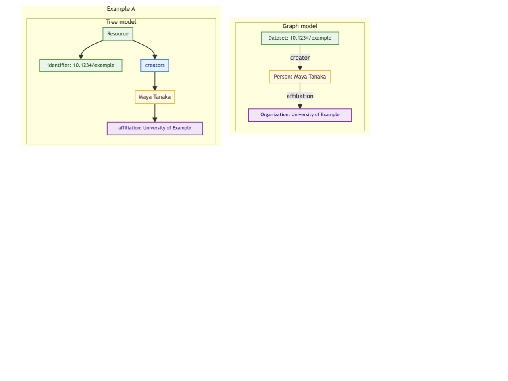
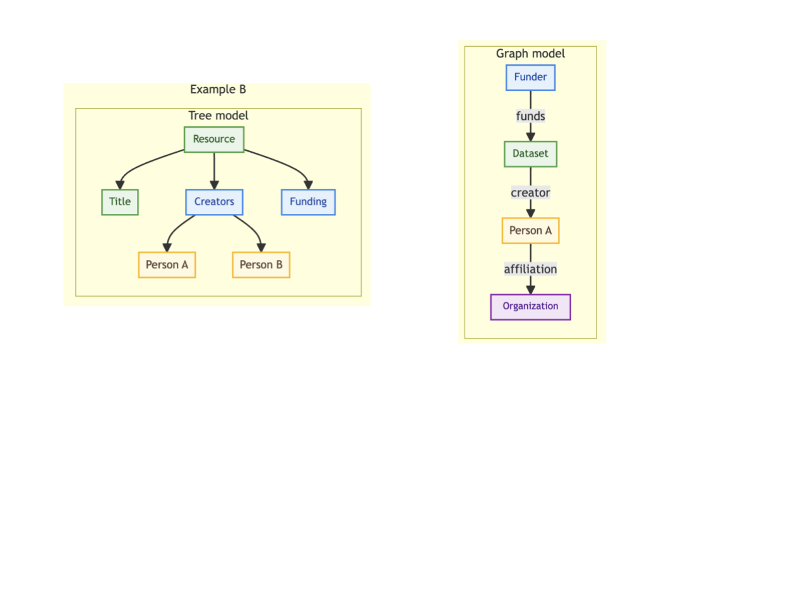

<!--more-->
Metadata has become central to how research is discovered, linked, and evaluated. Yet much of it still lives as structured text rather than as explicit, interoperable knowledge.

Within PID4NFDI, DataCite is presenting a dedicated semantic namespace for the [DataCite Metadata Schema](https://schema.datacite.org/):

**Staging site:** [https://schema.stage.datacite.org/linked-data/](https://schema.stage.datacite.org/linked-data/)  
**GitHub repository:** [https://github.com/datacite/schema.datacite.org-linked-data](https://github.com/datacite/schema.datacite.org-linked-data)

This work adds a linked data layer around parts of the [DataCite Metadata Schema 4.6](https://schema.datacite.org/meta/kernel-4.6/). In simple terms, it gives important DataCite concepts stable web identifiers and describes them in machine-readable files.

It does not replace the existing DataCite schema. Instead, it adds a semantic layer that helps systems interpret metadata more consistently and connect it more easily across tools and infrastructures.

## What Does “Linked Data” Actually Mean?

If you are new to linked data, the phrase can sound more technical than it really is.

A simple way to think about it is this:

* ordinary JSON uses short keys such as identifier or creatorName

* linked data connects those keys to full web identifiers

* those identifiers make the meaning of the data clearer to machines

So instead of seeing only a field called creator, a machine can understand that this field refers to a specific, defined relationship in a shared namespace.

That matters because different systems can then interpret the same metadata in a more consistent way.

## From Tree Structure to Relationships

Many of us are used to thinking about metadata as a tree.

A record contains fields. Some fields contain subfields. Everything is neatly nested. This works well for storage, display, and exchange.

But linked data encourages a slightly different way of thinking: not just in terms of nesting, but in terms of relationships.

For example, a dataset can be connected to a person. That person can be connected to an organization. A funder can be connected to a dataset. Once those connections are explicit, the metadata becomes easier to reuse across systems.

The difference looks like this:

***Figure 1:**  The figure compares two ways of understanding the same metadata. On the left, the tree model shows information as nested fields inside a single record: identifiers, creators, affiliations, and funding all appear as parts of that record. On the right, the graph model shows the same information as explicit relationships between distinct entities. In Example A, a dataset is connected to a person, and that person is connected to an organization. In Example B, a funder is connected to a dataset, which is then connected to a creator and that creator's organization. The key difference is that the tree model emphasizes structure inside one record, while the graph model emphasizes reusable connections between things.*

In the tree model, the focus is on where information sits inside the record. In the graph model, the focus is on how things relate to each other. That shift is the core idea behind linked data.

## **What We Are Presenting**

The linked data namespace currently provides:

* Stable IRIs for published schema resources, including classes, properties, vocabulary schemes, and vocabulary terms  
* Machine-readable definitions of those resources as JSON-LD files  
* Controlled vocabularies published as machine-readable concept schemes and term resources  
* JSON-LD contexts that map short keys to full identifiers  
* A manifest that inventories the staged linked data resources  
* Bundled distribution files for easier reuse as a single integrated graph  
* Human-browsable index pages for exploring the namespace in a browser  
* Guidance and examples related to XML-shaped JSON and round-tripping

In practical terms, this repository helps describe the meaning of DataCite metadata fields, not just their names.

It gives a linked data shape to concepts such as:

* identifier  
* creators  
* titles  
* publisher  
* publication year  
* resource type  
* related identifiers  
* contributors  
* rights  
* geolocations

That makes the schema easier to understand, reuse, and integrate into semantic workflows.

## **Why JSON-LD Matters**

JSON-LD is useful because it keeps data readable as JSON while also making the meaning of the data clearer.

That means the same metadata can be:

* easy for developers to inspect as JSON  
* more precise for linked data-aware tools  
* easier to convert into RDF-based forms such as Turtle or RDF/XML

For teams already working with JSON, this is helpful because it provides a path toward richer semantics without requiring a completely different way of working.

## **Why This Matters for Discovery and Reuse**

When metadata fields and controlled values are clearly defined, systems can do more with them.

For example:

* the same field can be interpreted more consistently across services  
* controlled values can be reused more reliably  
* connections between datasets, people, organizations, and funders become easier to model  
* metadata becomes easier to integrate into graph-based or knowledge-graph workflows

This does not mean that the repository turns every DataCite record into a full knowledge graph by itself.

What it does mean is that it makes the meaning of the schema more explicit, which is an important step toward better interoperability.

## **Supporting Both Community and Infrastructure**

This initiative is useful for different groups.

For repositories and publishers, it helps make metadata more semantically explicit while keeping familiar DataCite structures.

For infrastructure providers and graph builders, it offers resolvable IRIs, reusable vocabularies, machine-readable contexts, and bundled outputs that can be integrated into broader systems.

For teams working closely with XML and JSON transformations, the XML-shaped JSON guidance helps preserve structural fidelity where round-tripping is important, while still supporting semantic interpretation at the schema level.

The goal is not to make metadata creation harder.

The goal is to make metadata more understandable and more useful across connected systems.

## **What This Work Is, and What It Is Not**

This repository is:

* a linked data description of parts of the DataCite Metadata Schema  
* a semantic namespace for schema terms and controlled vocabularies  
* a staging environment for publishing and testing these resources

This repository is not:

* a DOI registration service  
* a complete validation engine  
* a full formal ontology with every possible rule and constraint

That distinction matters.

The current focus is on giving DataCite concepts stable identifiers and machine-readable meaning. It is about interpretation and interoperability, not replacing all existing schema tooling.

## **We Invite Your Feedback**

This is an early step toward a more connected and semantically explicit metadata ecosystem. The namespace is intended to evolve in dialogue with the community, and we welcome review, critique, and implementation feedback.

* RFCs and design feedback (Proposals category): [https://github.com/datacite/schema.datacite.org-linked-data/discussions/new?category=proposals](https://github.com/datacite/schema.datacite.org-linked-data/discussions/new?category=proposals)  
* Submit new ideas: [https://github.com/datacite/schema.datacite.org-linked-data/discussions/new?category=ideas](https://github.com/datacite/schema.datacite.org-linked-data/discussions/new?category=ideas)  
* Bugs or implementation tasks: [https://github.com/datacite/schema.datacite.org-linked-data/issues](https://github.com/datacite/schema.datacite.org-linked-data/issues)

Community input will help shape how this namespace develops and how it can best support real-world infrastructure and workflows.

## **For Beginners**

If you would like a more beginner-friendly walkthrough of the repository and its structure, see the project guide here:

[https://github.com/datacite/schema.datacite.org-linked-data/blob/main/info.md](https://github.com/datacite/schema.datacite.org-linked-data/blob/main/info.md)

**Thank you**
